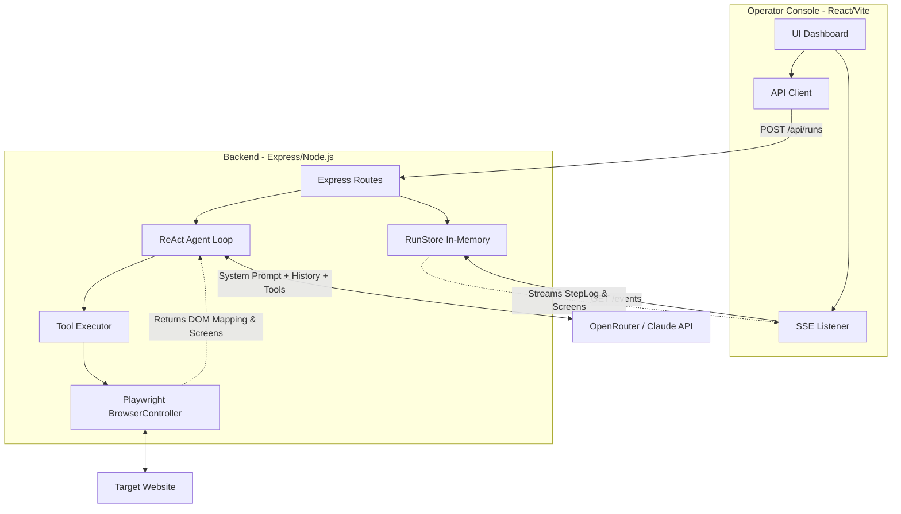

# System Architecture

## Overview
The Website Automation Agent is built on a decoupled architecture comprising an Express/Node.js backend and a React/Vite frontend. The core functionality centers around an autonomous orchestration loop that delegates complex reasoning to an LLM via OpenRouter, and executes precise browser actions via Playwright.

## Agent Orchestration Loop
1. **Task Initialization**: The user submits a natural-language task and a starting URL to `POST /api/runs`.
2. **Context Assembly**: The orchestrator builds an initial context containing a comprehensive `systemPrompt` and the user's task.
3. **Execution Cycle**: For up to `MAX_STEPS`:
   - The LLM receives the message history and available Playwright tools (defined via OpenAI JSON schema format).
   - If the LLM returns standard text, it emits a `reasoning` event.
   - If the LLM issues a `tool_call` (e.g., `send_keys`), the `ToolExecutor` routes it to the `BrowserController`.
   - The action is performed on the live browser.
   - A screenshot is captured (unless it's an initialization tool), returning visual state.
   - The result (and base64 image if requested via `take_screenshot`) is appended to the message history as a `tool_result` role.
   - The cycle repeats.
4. **Completion**: The LLM determines task completion and ceases tool calls, or max steps are reached.

## Hybrid Element Detection Strategy
The agent relies on a robust two-tiered approach to element detection:
1. **Structured First**: The LLM attempts to use Playwright locators (e.g., `text=Name` or `[name="description"]`) through the `send_keys` tool.
2. **Vision Fallback**: If structured interaction fails or is ambiguous, the LLM calls `take_screenshot`. This tool provides the LLM with a base64-encoded image of the current viewport. The LLM reasons about the pixel coordinates of the target element, utilizes `click_on_screen`, and follows up with a generic keyboard type.

## Real-time Communication
- **Server-Sent Events (SSE)**: Execution logs, tool call arguments, success/failure states, and screenshot URLs are pushed to the frontend in real-time via `GET /api/runs/:runId/events`.
- **In-Memory State**: Active runs are tracked in the backend `RunStore`, allowing clients to poll history or re-subscribe if SSE connection drops.

## Error Handling
Errors from Playwright are aggressively caught at the Action layer and returned as strings within the `tool_result`. This guarantees that tool failures inform the LLM's next iteration rather than crashing the node process, allowing the agent to adapt and retry.
